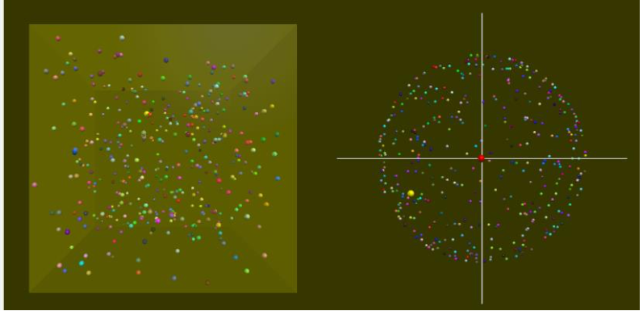

# VP11 Drift Velocity

## [HW PDF](https://drive.google.com/file/d/1pgzm50d1QOlHIQUmgBf3J94hOcN4HZHY/view?fbclid=IwAR2lNUibuf7qbFBMZVWwgEb2wuqETpLbTOaSDRswdGGpi-Wg3M2te6952I4)

## Contents  

+ [Introduction](#i-introduction)  
+ [Homework](#ii-homework)  

## I. Introduction

In the program, `N=400` charged particles, each with mass `m` and charge `q`, are in a cubic box of length `2*L`. The velocity of each particle have the same magnitude `vrms`, but with a random direction. With the periodic boundary condition, each particle hitting a wall will appear on the opposite side of wall with the same velocity. The two different displays, the position display (called "real space") and the velocity display (called "velocity space"), together form the "phase space" of the entire system. In this "phase space", the states (position and velocity) of all particles are completely represented. In the program, the drift velocity `vd`, which is the velocity averaged over all particles over all time, is found and shown in the velocity display as the larger red ball.

## II. Homework

### (1)

Within each time step `dt`, each particle has a probability (`prob`) to encounter a "collision" (Note: not a real collision against any other charged particle, but just a collision against some virtual particles). After the collision, the velocity of the particle has the same magnitude `vrms` but with a new random direction.

Find the collision time: `tau` = (total time `t`*`N`) / (total collision number of all particles of all time)

### (2)

Follow (1). If there is an electric field `E` to accelerate all particles, find the drift velocity `vd`. Is it close to the theoretical value `q*E*tau/m`?

 

### Template codes

```python
from vpython import *
import numpy as np

prob = 0.008
N, L = 400, 10e-9/2.0
E = 1500000
q, m, size = 1.6e-19, 1e-6/6e23, 0.1e-9
t, dt, vrms = 0, 1E-16, 100000.0
atoms, atoms_v = [], []

# Initialization
scene = canvas(width=600, height=600, align='left', background=vector(0.2,0.2,0))
scenev = canvas(width=600, height=600, align='left', fov=0.01, background=vector(0.2,0.2,0))

container = box(canvas=scene, length=2*L, height=2*L, width=2*L, opacity=0.2, color=color.yellow )

pos_array = -L + 2*L*np.random.rand(N,3)
theta = pi*np.random.rand(N,1).flatten()
phi = 2*pi*np.random.rand(N,1).flatten()
v_array = np.transpose(vrms*np.array([np.sin(theta)*np.cos(phi), np.sin(theta)*np.sin(phi), np.cos(theta)]))

def a_to_v(a):
    return vector(a[0], a[1], a[2])

for i in range(N):
    if i== N-1:
        atom = sphere(canvas=scene, pos=a_to_v(pos_array[i]), radius=2*size, color=color.yellow)
    else:
        atom = sphere(canvas=scene, pos=a_to_v(pos_array[i]), radius=size, color=a_to_v(np.random.rand(3,1)))
    atoms.append(atom)
    atoms_v.append(sphere(canvas=scenev, pos=a_to_v(v_array[i]), radius=vrms/70, color=a_to_v(np.random.rand(3,1))))

atoms_v[N-1].radius = vrms/30
atoms_v[N-1].color = color.yellow

vd_ball = sphere(canvas=scenev, pos=vec(0,0,0), radius=vrms/30, color=color.red)
x_axis = curve(canvas=scenev, pos=[vector(-1.4*vrms,0,0), vector(1.4*vrms,0,0)], radius=vrms/200)
y_axis = curve(canvas=scenev, pos=[vector(0,-1.4*vrms,0), vector(0,1.4*vrms,0)], radius=vrms/200)

vv = vector(0, 0, 0)
total_c = 0
while True:
    t += dt
    rate(10000)
    
    pos_array += v_array*dt
    outside = abs(pos_array) >= L
    pos_array[outside] = -pos_array[outside]
    vv += a_to_v(np.sum(v_array, axis=0) / N)
    
    # Handle collision here
    # ======= codes =======
    
    if int(t/dt)%2000 == 0:
        tau = 0    #find tau
        print(tau, vv/(t/dt), q*E*tau/m)
    vd_ball.pos = vv/(t/dt)

    for i in range(N):
        atoms_v[i].pos, atoms[i].pos = a_to_v(v_array[i]), a_to_v(pos_array[i])

```

### HW submission (PLZ be particularly aware!!)

+ Please upload a `zip` file (a compressed file) to CEIBA. Note that the filename extension should be `.zip`, and other format (e.g. `.rar` , `.tar` ...) is not allowed!!  
	> In this semester, please always upload the `zip` file even if there is only `must.py` to submit. (This would be helpful for me when downloading the hw. Thanks for the cooperation \~\~ :grin:)  

+ In the zip file, there will be **a directory whose name is your student ID.** The directory should contain 1 python scripts. Please name the script of must part: `must.py`.  


Example of submitted format: 
```
homework.zip
└── r07222016
    └── must.py
```

### Deadline
`04/19 SUN 22:00`  

### Grading Criteria (For Reference)    
Must  
0: No Submission.  
1: The program is totally not runnable.  
2: The animation and the results are strange.  
3: Both of the collision time and the drift velocity are not correct.  
4: The collision time is not correct or the drift velocity is not correct.  
5: You complete all the requirements, and they are all correct.  
