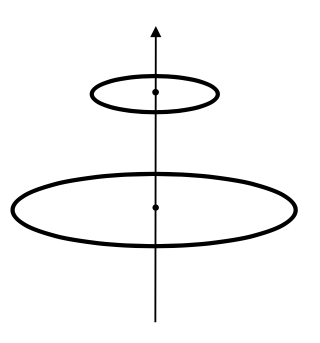
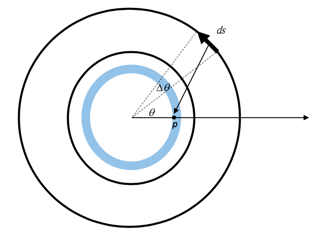

# VP12 Mutual Inductance

## [HW PDF](https://drive.google.com/file/d/1jS1vHrdGmOi_kgsSr4xvWS8ptn9R3cr_/view)

## Homework

There are two circular loops, with radii `R = 12 cm` on `z = 0 cm` plane and `r = 6 cm` on `z = Height = 10 cm` plane. Find the mutual inductance between the two loops by:
(1) Calculating the magnetic flux inside the small loop caused by the current on the large loop
(2) Vice versa.

 

You can do this by your own method (especially by `numpy` array calculation, that would give the results much faster). If you have no clue, you may try the following steps:

 

For part (1):
1. Partition the area inside the small loop into `m` ring areas.
2. Assume the large loop has a current `1A` on it. Cut the large loop into `n` pieces, each with length `ds`.
3. Find the magnetic field at position `p` due to the current on each `ds` by Biot-Savart law.
4. Sum the magnetic field cuased by the source from over all the `n` pieces `ds` along the large loop to get the total magnetic field at `p`.
5. Multiply the magnetic field with the area of the ring area to get the magnetic flux inside that ring area, and sum over all `m` rings to get the total flux inside the small loop due to the current on the large loop.
6.   
7. You can do similarly for part (2).
8. Check if the result of (1) = result of (2).


### HW submission (PLZ be particularly aware!!)
+ Please upload a `zip` file (a compressed file) to CEIBA. Note that the filename extension should be `.zip`, and other format (e.g. `.rar` , `.tar` ...) is not allowed!!  
	> In this semester, please always upload the `zip` file even if there is only `must.py` to submit. (This would be helpful for me when downloading the hw. Thanks for the cooperation \~\~ :grin:)  

+ In the zip file, there will be **a directory whose name is your student ID.** The directory should contain 1 python scripts. Please name the script of must part: `must.py`.  


Example of submitted format: 
```
homework.zip
└── r07222016
    └── must.py
```

### Deadline
`05/10 SUN 22:00; Late submission deadline: 05/13 WED 22:00`  

### Grading Criteria (For Reference)    
Must  
0: No Submission.  
1: The program is totally not runnable.  
2: The program is totally not runnable.  
3: The answers are not correct.  
4: Slightly wrong with the answers.  
5: You complete all the requirements, and they are all correct.  
    
