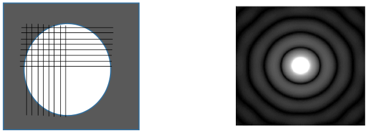

# VP14 Circular Aperture Diffraction
 

## [HW PDF](https://drive.google.com/file/d/19Xk_jpzIEb4NkeZdBsoUa6gmDDwmwvOa/view)

## Homework
This homework is to find the diffraction pattern of a circular aperture far from the screen.   
Assume there is a circular aperture of diameter `d = 100 μm` and there is a spherical screen at `R = 1 m` away. The light source is of wavelength `𝜆 = 500 nm`. To obtain the diffraction pattern, you can assume there are many point light sources at the lattice points, sitting at the cross points of the `N = 100` vertical lines and `N = 100` horizontal lines, each separated by `s = d/N = 1 μm` apart. If the lattice point’s position is within the circular aperture, then it is allowed to radiate light. Then on the screen you add all the electric field from the light sources of the grid points and you will be able to obtain the diffraction intensity pattern by squaring the electric field. (The detailed derivation is listed below.)   
In addition to (1) generating the intensity plot of the diffraction pattern, also (2) find and print the radius of the first dark ring and check whether the **Rayleigh criterion** `θ = 1.22 𝜆 / d` is satisfied.   
Also notice that, to calculate intensity is to do the square of the amplitude. However, the ‘real’ diffraction pattern is really faint to be observed on the computer screen. Therefore, we also do a ‘false’ intensity image of the diffraction pattern by taking the absolute value of the amplitude as the intensity. Of course, when you want to calculate the radius of the first dark ring, you should use the ‘real’ intensity image.

```python
from vpython import *
from numpy import *
N = 100
R, lamda = 1.0, 500E-9
d = 100E-6

dx, dy = d/N, d/N
scene1 = canvas(align = 'left', height=600, width=600, center = vector(N*dx/2, N*dy/2, 0))
scene2 = canvas(align = 'right', x=600, height=600, width=600, center = vector(N*dx/2, N*dy/2, 0))
scene1.lights, scene2.lights = [], []
scene1.ambient, scene2.ambient = color.gray(0.99), color.gray(0.99)
side = linspace(-0.01*pi, 0.01*pi, N)
x,y = meshgrid(side,side)

E_field = cos(10000*((x-0.005)**2 + (y- 0.002)**2 )) # change this to calculate the electric field of diffraction of the aperture

Inte = abs(E_field) ** 2
maxI = amax(Inte)
for i in range(N):
	for j in range(N):
		box(canvas = scene1, pos=vector(i*dx, j*dy, 0), length = dx, height= dy, width = dx,
			color=vector(Inte[i,j]/maxI,Inte[i,j]/maxI,Inte[i,j]/maxI))


Inte = abs(E_field)
maxI = amax(Inte)
for i in range(N):
	for j in range(N):
		box(canvas = scene2, pos=vector(i*dx, j*dy, 0), length = dx, height= dy, width = dx,
			color=vector(Inte[i,j]/maxI,Inte[i,j]/maxI,Inte[i,j]/maxI))
```


 


The amplitude of the electric field at position (x, y) on the screen gets its contribution from all point source sitting inside the aperture:

 

In this problem,  due to the symmetry of the integration on the ‘circular’ aperture. Therefore,

 

is the amplitude of the electric field on the spherical screen, which is the one you should calculate by summation over all the grid point on the aperture.

### HW submission (PLZ be particularly aware!!)
+ Please upload a `zip` file (a compressed file) to CEIBA. Note that the filename extension should be `.zip`, and other format (e.g. `.rar` , `.tar` ...) is not allowed!!  
    > In this semester, please always upload the `zip` file even if there is only `must.py` to submit. (This would be helpful for me when downloading the hw. Thanks for the cooperation \~\~ :grin:)  

+ In the zip file, there will be **a directory whose name is your student ID.** The directory should contain 1 python scripts. Please name the script of must part: `must.py`.  


Example of submitted format: 
```
homework.zip
└── r07222016
    └── must.py
```

### Deadline
`06/19 FRI 22:00; Late submission deadline: 06/21 SUN 22:00`  

### Grading Criteria (For Reference)    
Must  
0: No Submission.  
1: The program is totally not runnable.  
2: The animation and the results are strange.  
3: The animation is wrong.   
4: The calculation of the first dark ring is wrong (or fail to provide).  
5: You complete all the requirements, and they are all correct.  

    
